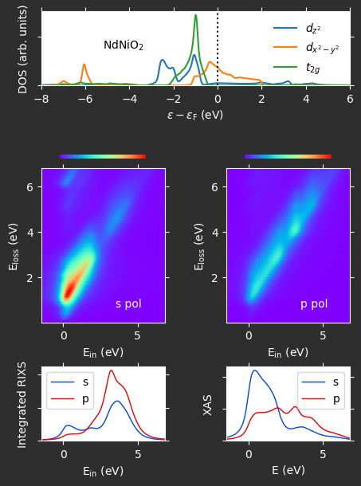
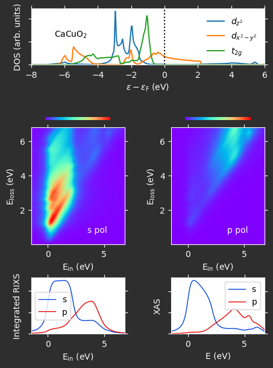

# Examples using dosrixs

Here we provide a few examples to see how to build a RIXS and/or XAS calculation using dosrixs. The example in ``example1.py`` reproduces the results in figures 4 and 5 of [](). We provide all of the tooling to flexibly describe the geometry, the polarizations, and states that are used in your calculation. Our API coupled with an electronic structure calculation of the density of states allows for virtually any kind of calculation.

```python
# define orbital states
d_orbitals = build_d_states()
core_states = build_core_states('L2')

# define incoming and outgoing polarizations for normal=z geometry
phi = np.deg2rad(180)
theta = np.deg2rad(15)
theta_prime = np.deg2rad(15-153)

EX, EY, EZ = build_electric_fields(normal='z')

s_pol      = np.sin(phi)*EX - np.cos(phi)*EY                                                # s, s'
p_pol      = np.cos(theta)*EZ + np.sin(theta)*(np.cos(phi)*EX + np.sin(phi)*EY)             # p
pprime_pol = np.cos(theta_prime)*EZ + np.sin(theta_prime)*(np.cos(phi)*EX + np.sin(phi)*EY) # p'

# compute matrix elements \sum_ϵ' M_if(ϵ,ϵ')

# --> computing rixs for s and p polarizations"
pol_rixs = rixs_matrix_elements(d_orbitals, core_states, [s_pol, p_pol], [s_pol, pprime_pol])

# --> computing xas for s and p polarizations", end= " ")
pol_xas = xas_matrix_elements(d_orbitals, core_states, [s_pol, p_pol])

# compute RISX cross section using DOS and matrix elements
e_mesh, dos = get_density_of_states('data/ndnio2-3d-dos.lda.txt')

# --> computing s pol and p pol rixs cross section
rixs = rixs_cross_section(e_mesh, dos, pol_rixs, Emin = -1.5, Emax = +7.0)

# --> computing s pol and p pol xas
xray = xas(e_mesh, dos, pol_xas, Emin = -1.5, Emax = +7.0)
```

The results of this calculation are shown below:

<p align="center">



</p>
